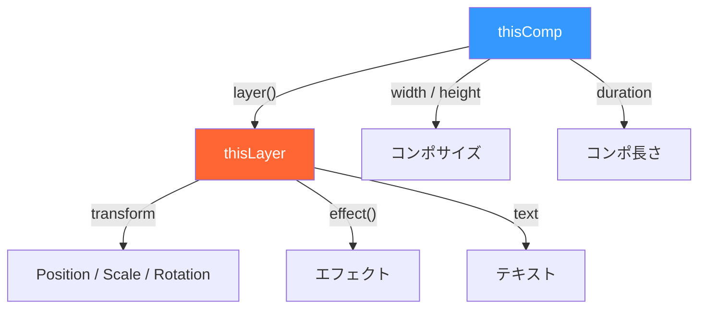

# 🎬 After Effects エクスプレッション 基礎ガイド

エクスプレッション（Expression）は、After Effects のプロパティ値を **JavaScript ベースのコード** で動的に制御する仕組み。キーフレームなしでアニメーションを生成できる。

---

## エクスプレッションの基本

### 適用方法

1. プロパティを **Alt + クリック**（Mac: **⌥ + クリック**）でストップウォッチを有効化
2. エクスプレッションエディタにコードを入力
3. Enter ではなく **テンキーの Enter** またはエディタ外をクリックで確定

### 言語設定

After Effects CC 2019 以降、エクスプレッション言語は **JavaScript** が推奨：

```
ファイル → プロジェクト設定 → エクスプレッション → エクスプレッションエンジン: JavaScript
```

> [!IMPORTANT]
> 旧来の `ExtendScript` エンジンでは一部の最新関数が使えない。**JavaScript エンジン** を必ず選択すること。

---

## 基本構文

### 値の返し方

エクスプレッションは **最後に評価された値** がそのプロパティの値になる：

```javascript
// Position（2D）→ [x, y] の配列を返す
[960, 540]

// Opacity → 単一の数値を返す
50

// Color → [r, g, b, a] の配列（0〜1）
[1, 0, 0, 1]  // 赤
```

### 変数宣言とコメント

```javascript
// 変数宣言（const / let / var いずれも可）
const speed = 100;
const amp = 50;

// 複数行のコメント
/* この部分は
   コメントになる */
```

### プロパティの型に応じた戻り値

| プロパティ | 型 | 戻り値の例 |
|-----------|-----|-----------|
| Position (2D) | `[x, y]` | `[960, 540]` |
| Position (3D) | `[x, y, z]` | `[960, 540, 0]` |
| Scale | `[x, y]` or `[x, y, z]` | `[100, 100]` |
| Rotation / Opacity | 数値 | `45` / `100` |
| Color | `[r, g, b, a]` (0〜1) | `[1, 0.5, 0, 1]` |
| Source Text | 文字列 | `"Hello"` |

---

## 重要なグローバルオブジェクト



| オブジェクト | 説明 | 例 |
|-------------|------|-----|
| `thisComp` | 現在のコンポジション | `thisComp.width` |
| `thisLayer` | エクスプレッションが適用されたレイヤー | `thisLayer.name` |
| `thisProperty` | エクスプレッションが適用されたプロパティ | `thisProperty.numKeys` |
| `time` | 現在の時間（秒） | `time * 100` |
| `value` | プロパティの現在の値（キーフレーム適用後） | `value + [10, 0]` |

---

## デバッグ方法

### エラーの確認

- エクスプレッションにエラーがあると、タイムライン上のプロパティ名が **オレンジ色** に変わる
- エラーバナーが表示され、クリックで詳細を確認できる

### コンソール的な確認方法

```javascript
// テキストレイヤーの sourceText に値を出力して確認
const debugValue = thisComp.layer("DebugTarget").transform.position;
debugValue.toString()
```

### よくあるエラーと対処

| エラー | 原因 | 対処 |
|--------|------|------|
| `Expected: ]` | 配列の閉じ括弧忘れ | `]` を確認 |
| `Not a valid expression` | 戻り値がプロパティ型と不一致 | Position に数値を返していないか確認 |
| `Cannot read property of null` | 参照レイヤー/プロパティが見つからない | レイヤー名・パスを確認 |
| `Dimension mismatch` | 次元が合わない（2D に 3D 値を返す等） | 配列の要素数を確認 |

---

## 辞書カテゴリ一覧

| # | カテゴリ | 内容 | ファイル |
|---|---------|------|---------|
| 01 | 基本プロパティ操作 | Position, Scale, Rotation, Opacity | `01_basic_properties.md` |
| 02 | 時間・フレーム | time, keyTime, inPoint, outPoint | `02_time_and_frames.md` |
| 03 | 数学・三角関数 | sin, cos, clamp, Math系 | `03_math_and_trigonometry.md` |
| 04 | 補間・イージング | ease, linear, bezier | `04_interpolation_easing.md` |
| 05 | ループ・繰り返し | loopIn, loopOut | `05_loop_and_repeat.md` |
| 06 | ウィグル・ランダム | wiggle, random, noise | `06_wiggle_and_random.md` |
| 07 | レイヤー参照・リンク | thisComp, parent, comp() | `07_layer_references.md` |
| 08 | テキスト | sourceText, タイプライター | `08_text_and_typography.md` |
| 09 | カラー | rgbToHsl, hexToRgb | `09_color_and_gradient.md` |
| 10 | 3D・カメラ | toWorld, toComp, lookAt | `10_3d_and_camera.md` |
| 11 | オーディオ連動 | audioLevels | `11_audio_driven.md` |
| 12 | 条件分岐 | if/else, try/catch | `12_conditional_logic.md` |
| 13 | 実践レシピ集 | よく使う組み合わせ | `13_practical_recipes.md` |
