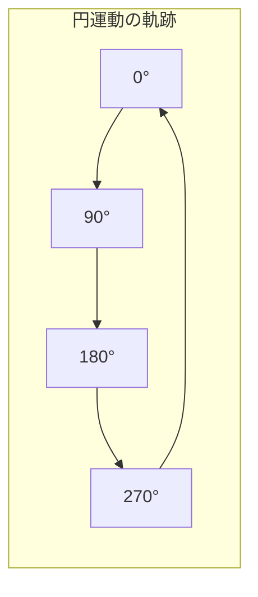

# 📐 基本プロパティ操作

Position, Scale, Rotation, Opacity, Anchor Point を制御するエクスプレッション集。

---

## Position（位置）

### 📌 等速直線運動
**用途**: レイヤーを一定速度で直線移動させる
**適用先**: Position
**難易度**: ⭐

```javascript
const speed = 200; // ピクセル/秒
value + [speed * time, 0]
```

**パラメータ解説:**
| パラメータ | 型 | 説明 |
|-----------|-----|------|
| `speed` | Number | 1秒あたりの移動ピクセル数 |
| `value` | Array | キーフレームの元の位置値 |

```
時間: 0s     1s     2s     3s
位置: |---→--|---→--|---→--|  (等速移動)
      0px   200px  400px  600px
```

> [!TIP]
> `[0, speed * time]` にすれば縦移動、`[speed * time, speed * time]` で斜め移動になる。

---

### 📌 円運動（Circular Motion）
**用途**: レイヤーを円形に回転移動させる
**適用先**: Position
**難易度**: ⭐⭐

```javascript
const radius = 200;  // 半径（ピクセル）
const speed = 1;     // 回転速度（回/秒）
const center = [thisComp.width / 2, thisComp.height / 2];

const angle = time * speed * 2 * Math.PI;
center + [Math.cos(angle) * radius, Math.sin(angle) * radius]
```

**パラメータ解説:**
| パラメータ | 型 | 説明 |
|-----------|-----|------|
| `radius` | Number | 円の半径 |
| `speed` | Number | 毎秒何回転するか |
| `center` | Array | 円の中心座標 |



> [!TIP]
> `radius` を `[200, 100]` のように配列にすれば楕円運動になる。

---

### 📌 バウンス（跳ねる動き）
**用途**: キーフレーム後に物理的な跳ね返りを追加
**適用先**: Position / Scale / Rotation
**難易度**: ⭐⭐

```javascript
const amp = 0.06;     // 振幅の強さ
const freq = 3.0;     // 振動の速さ
const decay = 5.0;    // 減衰の速さ

const n = 0;
if (numKeys > 0) {
  const n = nearestKey(time).index;
  if (key(n).time > time) n--;
}

if (n > 0) {
  const t = time - key(n).time;
  const v = velocityAtTime(key(n).time - 0.001);
  value + v * amp * Math.sin(freq * t * 2 * Math.PI) / Math.exp(decay * t);
} else {
  value;
}
```

**パラメータ解説:**
| パラメータ | 型 | 説明 |
|-----------|-----|------|
| `amp` | Number | バウンスの強さ（小さいほど控えめ） |
| `freq` | Number | 振動の頻度（大きいほど速く振動） |
| `decay` | Number | 減衰速度（大きいほど早く静止） |

```
                  ___
キーフレーム値 →  /   \   /\   /\
                /     \_/  \_/  \___  ← 静止
               /                    
              / (バウンス開始)
```

> [!TIP]
> `amp` を小さく（0.02〜0.04）すると上品な仕上がりに。`decay` を大きく（8〜12）すると素早く落ち着く。

---

### 📌 スプリング（弾性振動）
**用途**: キーフレーム後にバネのような弾力的な動き
**適用先**: Position / Scale
**難易度**: ⭐⭐

```javascript
const freq = 3;      // 振動周波数
const decay = 5;     // 減衰
// 最後のキーフレームを探す
if (numKeys > 0 && time > key(numKeys).time) {
  const t = time - key(numKeys).time;
  const delta = value - key(numKeys).value;
  value + delta * Math.sin(freq * t * 2 * Math.PI) * Math.exp(-decay * t);
} else {
  value;
}
```

---

### 📌 追従（Follow / Delay）
**用途**: 別レイヤーの位置を遅延して追いかける
**適用先**: Position
**難易度**: ⭐⭐

```javascript
const target = thisComp.layer("TargetLayer");
const delayTime = 0.1; // 遅延秒数
target.position.valueAtTime(time - delayTime)
```

**パラメータ解説:**
| パラメータ | 型 | 説明 |
|-----------|-----|------|
| `target` | Layer | 追いかける対象レイヤー |
| `delayTime` | Number | 遅延の秒数 |

> [!TIP]
> 複数レイヤーの連鎖追従は、各レイヤーの `delayTime` を `index * 0.1` にすると美しいトレイル効果になる。

---

## Scale（スケール）

### 📌 パルス（脈動）
**用途**: レイヤーを脈打つように拡大縮小
**適用先**: Scale
**難易度**: ⭐

```javascript
const scaleMin = 90;
const scaleMax = 110;
const speed = 2; // 脈動速度（回/秒）
const s = scaleMin + (scaleMax - scaleMin) * (Math.sin(time * speed * 2 * Math.PI) * 0.5 + 0.5);
[s, s]
```

```
100% ─ ─ ─ ─ ─ ─ ─ ─ ─  基準
      ╱╲    ╱╲    ╱╲
110% ╱  ╲  ╱  ╲  ╱  ╲    最大
    ╱    ╲╱    ╲╱    ╲
 90%                       最小
```

---

### 📌 出現時に弾むスケール（Overshoot Scale）
**用途**: 0→100にスケールアップ時、少し大きくなってから戻る
**適用先**: Scale
**難易度**: ⭐⭐

```javascript
const startTime = inPoint; // レイヤー開始時点
const duration = 0.4;       // アニメーション時間
const overshoot = 1.2;     // 最大超過サイズ（120%）
const bounces = 2;

const t = Math.max(0, time - startTime);
if (t >= duration) {
  [100, 100];
} else {
  const progress = t / duration;
  const elastic = 1 + (overshoot - 1) * Math.sin(progress * Math.PI * bounces) * (1 - progress);
  const s = progress * 100 * elastic / (progress * 100) * 100;
  [Math.min(s, overshoot * 100), Math.min(s, overshoot * 100)];
}
```

---

## Rotation（回転）

### 📌 等速回転（Constant Rotation）
**用途**: レイヤーを一定速度で回転し続ける
**適用先**: Rotation
**難易度**: ⭐

```javascript
const rpm = 10; // 1秒あたりの回転角度
time * rpm
```

> [!TIP]
> マイナス値で逆回転。360を指定すると1秒1回転。

---

### 📌 進行方向を向く回転（Auto-Orient by Expression）
**用途**: 移動方向にレイヤーが常に向く
**適用先**: Rotation
**難易度**: ⭐⭐

```javascript
const vel = thisLayer.position.velocityAtTime(time);
radiansToDegrees(Math.atan2(vel[1], vel[0]))
```

```
移動方向  →→→→   レイヤーの向き
  ↗↗↗↗            45°
  →→→→             0°
  ↘↘↘↘           -45°
```

---

### 📌 振り子（Pendulum）
**用途**: 振り子のように左右に揺れる
**適用先**: Rotation
**難易度**: ⭐

```javascript
const maxAngle = 30; // 最大角度
const speed = 2;     // 速度
maxAngle * Math.sin(time * speed * 2 * Math.PI)
```

---

## Opacity（不透明度）

### 📌 フェードイン / フェードアウト
**用途**: レイヤーの最初/最後で自動フェード
**適用先**: Opacity
**難易度**: ⭐

```javascript
const fadeIn = 0.5;  // フェードイン秒数
const fadeOut = 0.5; // フェードアウト秒数

const fadeInVal = ease(time, inPoint, inPoint + fadeIn, 0, 100);
const fadeOutVal = ease(time, outPoint - fadeOut, outPoint, 100, 0);
Math.min(fadeInVal, fadeOutVal)
```

```
Opacity
100% ┌─────────────────┐
     │                 │
     ╱                 ╲
  0% ╱                   ╲
     inPoint           outPoint
     ├──fadeIn──┤  ├──fadeOut──┤
```

---

### 📌 点滅（Blink / Flash）
**用途**: レイヤーを一定間隔で点滅させる
**適用先**: Opacity
**難易度**: ⭐

```javascript
const blinkSpeed = 4; // 1秒あたりの点滅回数
(Math.sin(time * blinkSpeed * Math.PI) > 0) ? 100 : 0
```

> [!TIP]
> `Math.PI` のかわりに `2 * Math.PI` を使い、`> 0` の代わりに `* 50 + 50` を使えば、滑らかなパルスになる。

---

### 📌 パーセント表示（段階的なフェード）
**用途**: 一定間隔ごとに段階的に不透明度を変える
**適用先**: Opacity
**難易度**: ⭐

```javascript
const steps = 5; // 段階数
const duration = 2; // 全体の秒数
const progress = Math.min(time / duration, 1);
Math.round(progress * steps) / steps * 100
```

---

## Anchor Point（アンカーポイント）

### 📌 レイヤー中央に自動設定
**用途**: アンカーポイントを常にレイヤー中央に配置
**適用先**: Anchor Point
**難易度**: ⭐

```javascript
const src = thisLayer.sourceRectAtTime(time, false);
[src.left + src.width / 2, src.top + src.height / 2]
```

> [!TIP]
> テキストレイヤーのアンカーポイント自動調整に特に有用。

### 📌 テキストレイヤーの左上揃え
**用途**: テキストのアンカーポイントを左上に自動配置
**適用先**: Anchor Point
**難易度**: ⭐

```javascript
const src = thisLayer.sourceRectAtTime(time, false);
[src.left, src.top]
```

### 📌 テキストレイヤーの左下揃え
**用途**: テキストのアンカーポイントを左下に自動配置
**適用先**: Anchor Point
**難易度**: ⭐

```javascript
const src = thisLayer.sourceRectAtTime(time, false);
[src.left, src.top + src.height]
```
