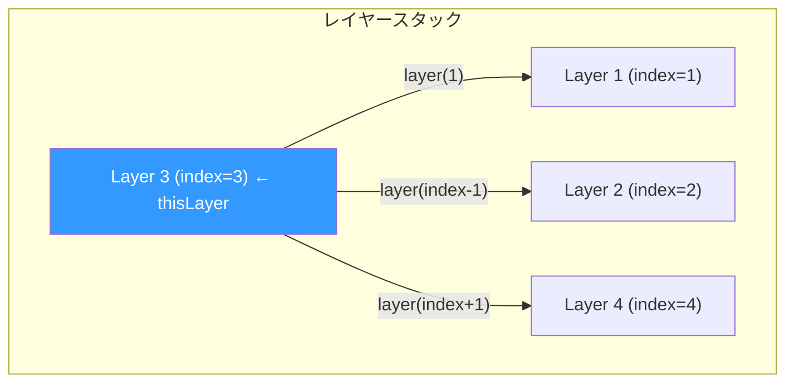
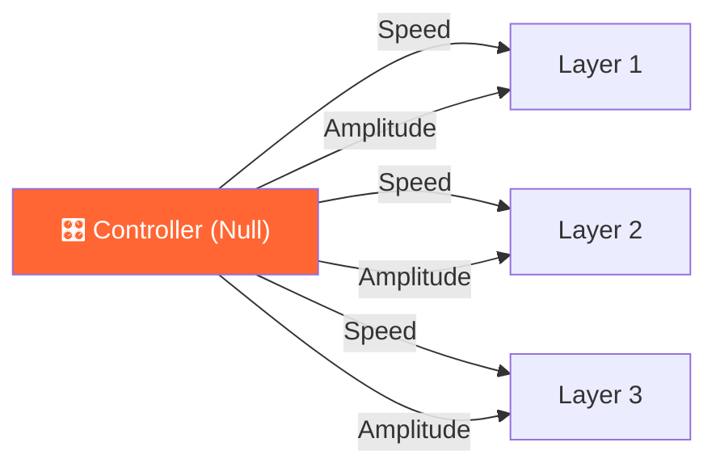

# 🔗 レイヤー参照・リンク

thisComp, thisLayer, parent, comp() 等を使ったレイヤー間の参照・リンクエクスプレッション集。

---

## 基本参照

### 📌 thisComp（現在のコンポジション）
**用途**: コンポジションのプロパティにアクセス
**適用先**: Any
**難易度**: ⭐

```javascript
// コンポジション情報
thisComp.width          // コンポの幅（ピクセル）
thisComp.height         // コンポの高さ
thisComp.duration       // コンポの長さ（秒）
thisComp.name           // コンポ名
thisComp.numLayers      // レイヤー数
thisComp.frameDuration  // 1フレームの秒数

// 中央座標
[thisComp.width / 2, thisComp.height / 2]
```

---

### 📌 thisLayer（自分自身のレイヤー）
**用途**: エクスプレッションが適用されたレイヤーのプロパティにアクセス
**適用先**: Any
**難易度**: ⭐

```javascript
thisLayer.name           // レイヤー名
thisLayer.index          // レイヤー番号（上から）
thisLayer.width          // レイヤーの幅
thisLayer.height         // レイヤーの高さ
thisLayer.inPoint        // 開始時間
thisLayer.outPoint       // 終了時間
thisLayer.hasParent      // 親レイヤーの有無
thisLayer.enabled        // レイヤーの表示状態

// トランスフォームプロパティ
thisLayer.transform.position
thisLayer.transform.scale
thisLayer.transform.rotation
thisLayer.transform.opacity
thisLayer.transform.anchorPoint
```

---

### 📌 thisProperty / value
**用途**: 現在のプロパティ自身の情報にアクセス
**適用先**: Any
**難易度**: ⭐

```javascript
thisProperty.name        // プロパティ名（"Position" 等）
thisProperty.numKeys     // キーフレーム数
thisProperty.value       // 現在の値（= value と同じ）

// value: キーフレームがある場合はキーフレーム値、なければ手入力値
value                    // 現在のプロパティ値
value + [10, 0]         // 値のオフセット
```

---

## 他レイヤーの参照

### 📌 名前でレイヤーを参照
**用途**: 特定の名前のレイヤーのプロパティを取得
**適用先**: Any
**難易度**: ⭐

```javascript
// レイヤー名で参照
thisComp.layer("Controller").transform.position
thisComp.layer("Background").transform.opacity

// インデックスで参照
thisComp.layer(1).transform.position  // 一番上のレイヤー

// 相対インデックスで参照（自分から何番目のレイヤーか）
thisComp.layer(index - 1).transform.position  // 1つ上のレイヤー
thisComp.layer(index + 1).transform.position  // 1つ下のレイヤー
```



> [!WARNING]
> レイヤー名の参照は **名前が変わると壊れる** 。重要なリンクには「名前を変更しない」ルールを徹底するか、ヌルオブジェクトをコントローラーとして使う。

---

### 📌 エフェクトプロパティの参照
**用途**: エフェクトのスライダー/カラーピッカー等をエクスプレッションで取得
**適用先**: Any
**難易度**: ⭐

```javascript
// 自分のエフェクトを参照
effect("Slider Control")("Slider")
effect("Color Control")("Color")
effect("Checkbox Control")("Checkbox")
effect("Point Control")("Point")

// 他レイヤーのエフェクトを参照
thisComp.layer("Controller").effect("Speed")("Slider")
```

> [!TIP]
> **エクスプレッション制御** エフェクトをヌルオブジェクトに追加し、それを各レイヤーから参照する「コントローラーパターン」は実務で最も使われるテクニック。

---

### 📌 コントローラーパターン（推奨設計）
**用途**: 1つのヌルオブジェクトから複数レイヤーを制御
**適用先**: Any
**難易度**: ⭐⭐

```javascript
// ===== コントローラー設定 =====
// 1. ヌルオブジェクト「Controller」を作成
// 2. エフェクト → エクスプレッション制御 → スライダー制御 を追加
// 3. スライダー名を "Speed" に変更

// ===== 各レイヤーのエクスプレッション =====
const ctrl = thisComp.layer("Controller");
const speed = ctrl.effect("Speed")("Slider");
const amplitude = ctrl.effect("Amplitude")("Slider");
const color = ctrl.effect("Color")("Color");

// 使用例
wiggle(speed, amplitude)
```



---

## 親子関係（Parenting）

### 📌 parent（親レイヤー参照）
**用途**: 親レイヤーのプロパティにアクセス
**適用先**: Any
**難易度**: ⭐

```javascript
// 親レイヤーの位置
thisLayer.parent.transform.position

// 親がいるかチェック
if (thisLayer.hasParent) {
  thisLayer.parent.transform.rotation;
} else {
  0;
}
```

---

### 📌 親の回転を無視する
**用途**: 親にリンクしながら回転だけ独立させる
**適用先**: Rotation
**難易度**: ⭐⭐

```javascript
// 親の回転を打ち消す
value - thisLayer.parent.transform.rotation
```

---

### 📌 親のスケールを無視する
**用途**: 親にリンクしながらスケールだけ独立させる
**適用先**: Scale
**難易度**: ⭐⭐

```javascript
// 親のスケールを打ち消す
const parentScale = thisLayer.parent.transform.scale;
[100 / parentScale[0] * value[0] * 100, 
 100 / parentScale[1] * value[1] * 100]
```

---

## 他のコンポジションの参照

### 📌 comp()（別コンポジションを参照）
**用途**: プロジェクト内の別コンポジションのレイヤーを参照
**適用先**: Any
**難易度**: ⭐⭐

```javascript
// 別のコンポジションのレイヤーを参照
comp("Other Comp").layer("Target").transform.position

// 別コンポのサイズ
comp("Other Comp").width
comp("Other Comp").height
```

> [!CAUTION]
> 別コンポ参照は **パフォーマンスに影響** する場合がある。必要な場合のみ使用すること。

---

## インデックスベースのテクニック

### 📌 index でレイヤーごとにオフセット
**用途**: 複数レイヤーにコピーしたとき、自動で値が変わる
**適用先**: Any
**難易度**: ⭐

```javascript
// レイヤーごとに位置をずらす
[index * 100, value[1]]

// レイヤーごとに遅延
const delay = index * 0.1;
thisComp.layer(1).transform.position.valueAtTime(time - delay)

// レイヤーごとにサイズを変える
const baseScale = 100 - index * 10;
[baseScale, baseScale]
```

```
index=1:  ■
index=2:    ■
index=3:      ■
index=4:        ■
index=5:          ■
  → index * 100 で自動的に配置
```

> [!TIP]
> `index` は複数レイヤーの「カスケード」アニメーションの基本。タイミングずらし、位置ずらし、サイズ変化のすべてに使える。
