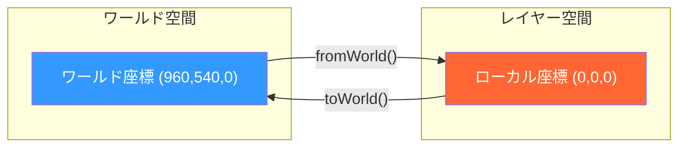

# 📷 3D・カメラ

toWorld, toComp, lookAt, カメラ追従等の3D空間とカメラ制御エクスプレッション集。

---

## 座標変換

### 📌 toWorld / fromWorld
**用途**: レイヤーのローカル座標とワールド座標を変換
**適用先**: Position / Any
**難易度**: ⭐⭐

```javascript
// ローカル座標 → ワールド座標
thisLayer.toWorld([0, 0, 0])  // レイヤーの原点のワールド座標

// ワールド座標 → ローカル座標
thisLayer.fromWorld([960, 540, 0])

// アンカーポイントのワールド位置
thisLayer.toWorld(thisLayer.anchorPoint)
```



---

### 📌 toComp / fromComp
**用途**: レイヤー座標とコンポジション座標の変換
**適用先**: Position
**難易度**: ⭐⭐

```javascript
// レイヤー座標 → コンポ座標（2Dでも使える）
thisLayer.toComp([0, 0])

// 別レイヤーのアンカーポイントのコンポ座標
const target = thisComp.layer("Target");
target.toComp(target.anchorPoint)

// 2Dレイヤーが3D親の影響を受ける場合の実座標
thisLayer.toComp([0, 0, 0])
```

> [!TIP]
> `toComp` は親子関係やトランスフォームを含んだ「実際の画面上の位置」を返すので、複雑な階層構造でも正確な位置が分かる。

---

### 📌 toWorldVec / fromWorldVec
**用途**: 方向ベクトルの座標変換（位置ではなく方向）
**適用先**: Any
**難易度**: ⭐⭐⭐

```javascript
// ローカルの「右方向」をワールド空間で取得
const localRight = [1, 0, 0];
const worldRight = thisLayer.toWorldVec(localRight);

// ワールドの「上方向」をローカルに変換
const worldUp = [0, -1, 0];
const localUp = thisLayer.fromWorldVec(worldUp);
```

---

## カメラ

### 📌 カメラの情報取得
**用途**: アクティブカメラのプロパティにアクセス
**適用先**: Any
**難易度**: ⭐⭐

```javascript
// アクティブカメラ
const cam = thisComp.activeCamera;

// カメラの位置
cam.transform.position

// カメラの焦点距離
cam.cameraOption.zoom

// カメラの被写界深度
cam.cameraOption.depthOfField  // on/off
cam.cameraOption.focusDistance
cam.cameraOption.aperture
cam.cameraOption.blurLevel
```

---

### 📌 カメラからの距離に応じた制御
**用途**: カメラに近いレイヤーほど大きく/明るくする
**適用先**: Scale / Opacity
**難易度**: ⭐⭐⭐

```javascript
// カメラからの距離
const cam = thisComp.activeCamera;
const camPos = cam.toWorld([0, 0, 0]);
const layerPos = thisLayer.toWorld(thisLayer.anchorPoint);
const dist = length(camPos, layerPos);

// 距離に応じてOpacityを変化
linear(dist, 200, 2000, 100, 0)
```

```
カメラ    近いレイヤー        遠いレイヤー
  📷 ───── ■ (100%) ─────── □ (50%) ─────── ░ (10%)
           dist=200         dist=1000        dist=2000
```

---

### 📌 カメラに常に正面を向ける（ビルボード）
**用途**: 3Dレイヤーが常にカメラ方向を向く
**適用先**: Orientation
**難易度**: ⭐⭐⭐

```javascript
const cam = thisComp.activeCamera;
const camPos = cam.toWorld([0, 0, 0]);
lookAt(toWorld(anchorPoint), camPos)
```

---

## lookAt

### 📌 lookAt（特定の方向を向く）
**用途**: レイヤーが特定の3Dポイントを向くように回転
**適用先**: Orientation
**難易度**: ⭐⭐

```javascript
// ターゲットの方向を向く
const target = thisComp.layer("Target").transform.position;
lookAt(thisLayer.position, target)
```

**パラメータ解説:**
| パラメータ | 型 | 説明 |
|-----------|-----|------|
| 第1引数 | Array[3] | 自分の位置 |
| 第2引数 | Array[3] | ターゲットの位置 |
| 戻り値 | Array[3] | [X回転, Y回転, Z回転] |

---

### 📌 2Dで lookAt（Z軸回転のみ）
**用途**: 2Dレイヤーがターゲット方向を向く
**適用先**: Rotation
**難易度**: ⭐⭐

```javascript
const target = thisComp.layer("Target").transform.position;
const delta = target - position;
radiansToDegrees(Math.atan2(delta[1], delta[0]))
```

---

## 3D レイヤーの応用

### 📌 Z軸奥行きに応じたスケール
**用途**: 3D空間でZ位置が遠いほど小さくする（パースペクティブ模倣）
**適用先**: Scale
**難易度**: ⭐⭐

```javascript
const z = position[2];
const baseDist = 1000; // 基準距離
const s = baseDist / (baseDist + z) * 100;
[s, s]
```

---

### 📌 3Dレイヤーの位置を円形配置
**用途**: 複数の3Dレイヤーを円形に自動配置
**適用先**: Position (3D)
**難易度**: ⭐⭐

```javascript
const totalLayers = 12;     // 全レイヤー数
const radius = 500;         // 円の半径
const center = [thisComp.width / 2, thisComp.height / 2, 0];

const angle = (index - 1) / totalLayers * 2 * Math.PI;
center + [
  Math.cos(angle) * radius,
  0,
  Math.sin(angle) * radius
]
```

```
上から見た図（XZ平面）:
        ■
    ■       ■
  ■           ■
  ■     ✦     ■  ← 中心
  ■           ■
    ■       ■
        ■
```

---

### 📌 3Dパーティクル風の浮遊
**用途**: 3Dレイヤーがランダムに浮遊する
**適用先**: Position (3D)
**難易度**: ⭐⭐

```javascript
seedRandom(index, false);
const basePos = value;
const floatAmp = [30, 50, 20];
const floatSpeed = random(0.5, 1.5);

basePos + [
  Math.sin(time * floatSpeed) * floatAmp[0],
  Math.cos(time * floatSpeed * 0.7) * floatAmp[1],
  Math.sin(time * floatSpeed * 0.5) * floatAmp[2]
]
```
