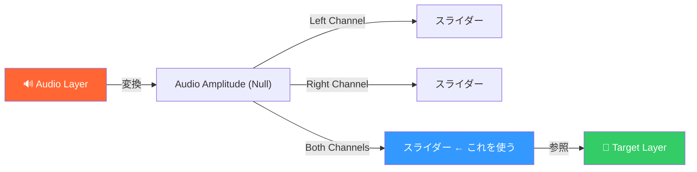

# 🔊 オーディオ連動

audioLevels を使ったオーディオリアクティブなエクスプレッション集。

---

## 基本概念

> [!IMPORTANT]
> オーディオ連動エクスプレッションは、オーディオレイヤーに **キーフレームを事前にベイク** する必要がある場合がある。
> **手順**: オーディオレイヤーを選択 → `アニメーション` → `キーフレーム補助` → `オーディオをキーフレームに変換`

---

## audioLevels

### 📌 基本のオーディオレベル取得
**用途**: オーディオの音量レベルを取得してプロパティを制御
**適用先**: Any
**難易度**: ⭐⭐

```javascript
// 左チャンネルの音量（dB）
thisComp.layer("Audio").audioLevels[0]

// 右チャンネルの音量（dB）
thisComp.layer("Audio").audioLevels[1]

// 左右の平均
const L = thisComp.layer("Audio").audioLevels[0];
const R = thisComp.layer("Audio").audioLevels[1];
(L + R) / 2
```

**パラメータ解説:**
| インデックス | 説明 | 値の範囲 |
|-------------|------|---------|
| `[0]` | 左チャンネル | -48〜0 dB |
| `[1]` | 右チャンネル | -48〜0 dB |

```
音量 (dB):
  0 dB ──────── ← 最大音量
-12 dB ──────── ← 通常の音量
-24 dB ──────── ← 小さめ
-48 dB ──────── ← 無音（最小）
```

---

### 📌 音量でスケールを制御（バウンス）
**用途**: 音に合わせてレイヤーが拡大縮小する
**適用先**: Scale
**難易度**: ⭐⭐

```javascript
const audioLayer = thisComp.layer("Audio");
const L = audioLayer.audioLevels[0];
const R = audioLayer.audioLevels[1];
const avg = (L + R) / 2;

// dBを0〜1に正規化 (-48dB=0, 0dB=1)
const normalized = linear(avg, -48, 0, 0, 1);

// スケールに変換
const baseScale = 100;
const maxBoost = 30; // 最大でbaseScale + 30%
const s = baseScale + normalized * maxBoost;
[s, s]
```

```
音量:  🔊───────🔈──────🔇──────
Scale: 130%     115%     100%
       最大      中       基本
```

---

### 📌 音量で位置を制御（ビジュアライザー風）
**用途**: オーディオバー / イコライザー風の動き
**適用先**: Position / Scale
**難易度**: ⭐⭐

```javascript
// Y位置を音量で制御（上に跳ねる）
const audioLayer = thisComp.layer("Audio");
const avg = (audioLayer.audioLevels[0] + audioLayer.audioLevels[1]) / 2;
const normalized = linear(avg, -48, 0, 0, 1);

const baseY = thisComp.height - 100;
const maxJump = 400;
[value[0], baseY - normalized * maxJump]
```

---

### 📌 音量で不透明度を制御
**用途**: 音に合わせてレイヤーが明滅
**適用先**: Opacity
**難易度**: ⭐

```javascript
const audioLayer = thisComp.layer("Audio");
const avg = (audioLayer.audioLevels[0] + audioLayer.audioLevels[1]) / 2;
linear(avg, -48, -6, 0, 100)
```

---

### 📌 音量で回転を制御
**用途**: 音に合わせてレイヤーが回転する
**適用先**: Rotation
**難易度**: ⭐⭐

```javascript
const audioLayer = thisComp.layer("Audio");
const avg = (audioLayer.audioLevels[0] + audioLayer.audioLevels[1]) / 2;
const normalized = linear(avg, -48, 0, 0, 1);

// 累積回転（音量が大きいほど速く回る）
value + normalized * 10
```

---

## 「オーディオをキーフレームに変換」方式

### 📌 変換後のスライダーを使う方式
**用途**: 事前にオーディオをキーフレーム化し、安定した結果を得る
**適用先**: Any
**難易度**: ⭐⭐

```javascript
// 手順:
// 1. オーディオレイヤーを選択
// 2. アニメーション → キーフレーム補助 → オーディオをキーフレームに変換
// 3. 「Audio Amplitude」ヌルが自動生成される
// 4. そのヌルの「Both Channels」スライダーを参照

const amp = thisComp.layer("Audio Amplitude").effect("Both Channels")("Slider");

// スケールに変換
const s = linear(amp, 0, 30, 100, 150);
[s, s]
```



> [!TIP]
> 「オーディオをキーフレームに変換」方式の方が安定してプレビューできるので、本番ではこちらを推奨。

---

## スムージング

### 📌 オーディオ値のスムージング
**用途**: 音量の急激な変化を滑らかにする
**適用先**: Any
**難易度**: ⭐⭐

```javascript
const audioLayer = thisComp.layer("Audio");
const smoothTime = 0.1; // スムージング幅（秒）

// 複数フレームの平均を取る
const samples = 5;
let total = 0;
for (let i = 0; i < samples; i++) {
  const t = time - i * smoothTime / samples;
  const levels = audioLayer.audioLevels.valueAtTime(t);
  total += (levels[0] + levels[1]) / 2;
}
const avg = total / samples;

linear(avg, -48, 0, 0, 100)
```

---

### 📌 ピーク保持（Peak Hold）
**用途**: ピーク値を一定時間保持してゆっくり下降
**適用先**: Any
**難易度**: ⭐⭐⭐

```javascript
const audioLayer = thisComp.layer("Audio");
const holdTime = 0.3;  // ピーク保持時間
const fallRate = 200;  // 下降速度

// 過去のフレームから最大値を探す
const lookback = holdTime;
const steps = 10;
let peak = -48;

for (let i = 0; i <= steps; i++) {
  const t = time - i * lookback / steps;
  if (t >= 0) {
    const levels = audioLayer.audioLevels.valueAtTime(t);
    const avg = (levels[0] + levels[1]) / 2;
    if (avg > peak) peak = avg;
  }
}

linear(peak, -48, 0, 0, 100)
```
