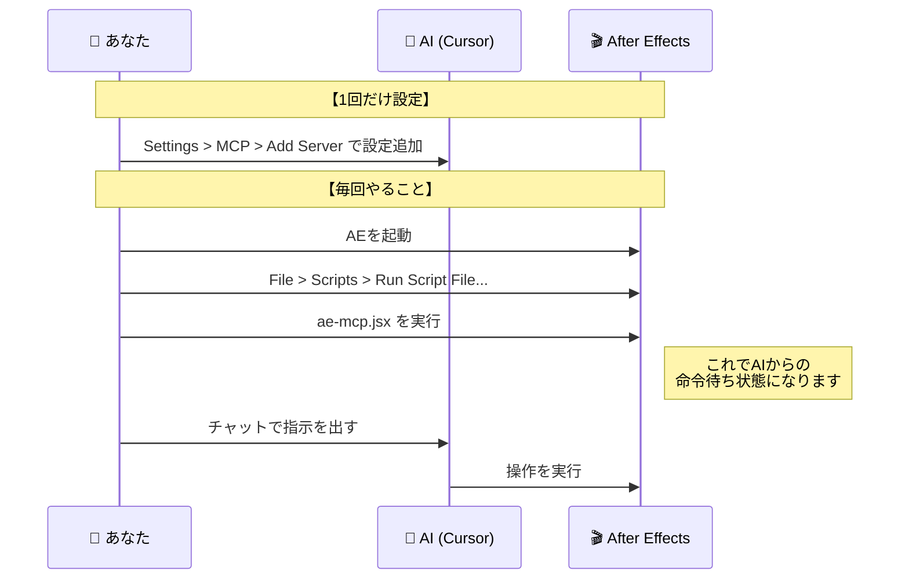

# After Effects MCP Server ユーザーマニュアル

このマニュアルでは、AI (Claude, Cursorなど) を使ってAdobe After Effectsを自動操作するための **After Effects MCP Server** の使い方を解説します。

---

## 📖 目次
1. [はじめに](#1-はじめに)
2. [システム構成図](#2-システム構成図)
3. [セットアップ手順](#3-セットアップ手順)
4. [🔰 初心者向けガイド](#4-初心者のための基本的な使い方)
5. [🔧 上級者向けガイド](#5-上級者のための応用テクニック)
6. [トラブルシューティング](#6-トラブルシューティング)

---

## 1. はじめに

**AE MCP Server** は、AIとAfter Effectsを会話させるための「通訳」のようなツールです。
これを使うことで、複雑なメニュー操作やスクリプト書きをAIに任せ、自然な言葉で映像制作ができるようになります。

**できること:**
- 「10秒のコンポジションを作って」と頼むだけで作成
- 「テキストレイヤーを追加して」と指示
- エフェクトの適用やパラメータ調整
- 面倒な単純作業（全レイヤーのリネームなど）の自動化

---

## 2. システム構成図

以下の図は、あなたの指示がどうやってAfter Effectsに届くかを示しています。

```mermaid
graph LR
    User[👤 あなた] -->|「コンポ作って」| AI[🤖 AI (Cursor/Claude)]
    AI -->|JSONコマンド| MCP[🚀 AE MCP Server]
    
    subgraph Adobe After Effects
        MCP -->|ExtendScript| AE[🎬 After Effects]
        AE -->|結果を返信| MCP
    end
    
    MCP -->|「作りました」| AI
    AI -->|完了報告| User

    style MCP fill:#f9f,stroke:#333,stroke-width:2px
    style AE fill:#9945FF,stroke:#333,stroke-width:2px,color:#fff
```

---

## 3. セットアップ手順

既にインストール作業は完了していますが、起動手順を再確認します。



---

## 4. 初心者のための基本的な使い方

まずは「**チャットで具体的な指示を出す**」ことから始めましょう。AIは具体的な数値や名前があると正確に動きます。

### 📌 シナリオ1: 基本的なコンポジション作成

**プロンプト例:**
> 「1920x1080、30fps、デュレーション10秒の『メイン動画』というコンポジションを作成してください。」

**AIの動作:**
1. `create_composition` ツールを呼び出す
2. 指定されたパラメータでコンポを作成
3. 作成完了を報告

### 📌 シナリオ2: テキストアニメーション

**プロンプト例:**
> 「『Hello World』という白いテキストレイヤーを中心に追加して。フォントサイズは100pxで。
> その後、0フレーム目で不透明度0%、30フレーム目で100%になるフェードインアニメーションをつけて。」

**ポイント:**
- **色**: "白" "赤" (#FFFFFF) など具体的に
- **場所**: "中心に" "右上に"
- **タイミング**: "0フレーム目で〜" "1秒地点で〜"

### 📌 シナリオ3: 単純作業の自動化

**プロンプト例:**
> 「選択しているコンポジション内のすべてのレイヤーの名前の末尾に『_v1』をつけてください。」

---

## 5. 上級者のための応用テクニック

AE MCP Serverの真価は、**複雑なロジック処理**や**外部データとの連携**にあります。

### 🔥 テクニック1: 数式・スクリプトによる制御

AIにエクスプレッション（AEの制御言語）を書かせることができます。

**プロンプト例:**
> 「円形のシェイプレイヤーを追加して。
> 位置プロパティに、`Math.sin(time)*100` を使って左右に揺れるエクスプレッションを適用して。」

### 🔥 テクニック2: ランダム・ジェネラティブ表現

**プロンプト例:**
> 「画面内にランダムな色と大きさの正方形を50個生成して配置してください。
> それぞれの不透明度は50%〜80%のランダムで設定して。」

**仕組み:**
AIがループ処理を行い、50回分の「レイヤー追加コマンド」を高速に実行します。手作業なら30分かかる作業が数秒で終わります。

### 🔥 テクニック3: Manim (数学アニメーション) 連携

このサーバーはPythonの数学アニメーションライブラリ `Manim` と連携できます。

**プロンプト例:**
> 「Manimを使って、ピタゴラスの定理を証明するアニメーション動画を生成し、現在のコンポに読み込んで。」

### 🔥 テクニック4: 複雑なエフェクトチェーン

**プロンプト例:**
> 「調整レイヤーを追加して、以下のエフェクトを順番にかけて：
> 1. ガウスブラー (ブラー: 15)
> 2. トーンカーブ (S字にコントラスト強調)
> 3. ノイズ (量: 5%)
> シネマティックなルックにして。」

---

## 6. トラブルシューティング

| 症状 | 原因 | 対策 |
|------|------|------|
| **AIが「ツールが見つからない」と言う** | MCP設定ミス | Cursorの設定画面でMCP Serverが緑色（Connected）になっているか確認してください。 |
| **コマンドは送られたがAEが動かない** | スクリプト未実行 | AE側で `ae-mcp.jsx` が実行されているか確認してください。AEを再起動した場合は再実行が必要です。 |
| **エラーが出る (Connection refused)** | サーバーダウン | `ae-mcp.jsx` を一度閉じて、再度実行してください。 |
| **日本語が文字化けする** | フォントの問題 | プロンプトで「日本語対応フォント（Noto Sans JPなど）を使って」と指定してください。 |

---

> 💡 **PDFとしての保存方法**
>
> この画面はMarkdown形式です。PDFにするには：
> 1. VS Code / Cursorでこのファイルを開く
> 2. コマンドパレット (`Cmd+Shift+P`) を開く
> 3. `Markdown PDF: Export (pdf)` を実行 (拡張機能が必要な場合があります)
> 4. または、プレビュー画面を開いて `Cmd+P` で「PDFとして保存」を選択してください。
